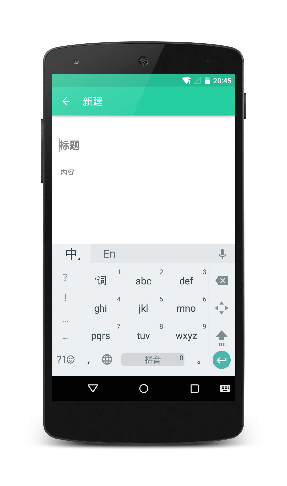

# SimpleNote
一个轻量简单的笔记应用，让你可以随时随地，记录身边点滴。

**应用地址:** [APK](http://fir.im/simplenote)

#应用截图





#开发环境
- Android Studio 2.0
- JDK 1.8
- Android Buid Tool 23
- Android Compile Sdk 23


#0.1.0(beta)
- Android 应用当然要用 Material Design风格
- 仅支持 Android4.4 及以上的系统
- 第一版比较糙，只实现了重要的功能，不过 [Done is better than perfect](http://www.ruanyifeng.com/blog/2012/02/facebook_slogans.html)

#TODO
- [ ] 回收站
- [ ] 每一个卡片可以让用户选择颜色
- [ ] 字体还是不够美观
- [ ] 复制笔记全部文字到剪切板
- [ ] 将笔记以二维码的形式分享，扫描二维码添加笔记
- [ ] 以图片的形式对笔记进行分享


  
  
#感谢
- 感谢[lguipeng](https://github.com/lguipeng)的[Notes](https://github.com/lguipeng/Notes),感谢他的开源项目，帮助了我很多，而且做了很多我想做却没有做的，真的非常感谢
- 感谢[drakeet](https://github.com/drakeet)，一个非常非常优秀的Android开发者
- 感谢[fflamingogo](https://github.com/fflamingogo)和[Simon](https://github.com/SimonWuQM)的帮助
- 感谢[kate](http://reitou.lofter.com/)给我做的应用logo，一个很厉害的设计妹纸


#关于我
- 一个低级 Android 开发搬运工
- 个人主页:[hedge_hog](http://hedgehog.love/) (并没有什么干货)
- Email: ciwei17@gmail.com

#License
```
Copyright 2016 hedge_hog

Licensed under the Apache License, Version 2.0 (the "License");
you may not use this file except in compliance with the License.
You may obtain a copy of the License at

    http://www.apache.org/licenses/LICENSE-2.0

Unless required by applicable law or agreed to in writing, software
distributed under the License is distributed on an "AS IS" BASIS,
WITHOUT WARRANTIES OR CONDITIONS OF ANY KIND, either express or implied.
See the License for the specific language governing permissions and
limitations under the License.
```
